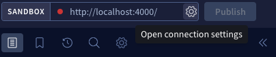

# folio-graphql
## Getting Started
The API is built using the [Apollo GraphQL server](https://www.apollographql.com/docs/apollo-server/), which requires nodeJS v14 or later. Install dependencies with npm:
```sh
npm install
```
Before starting up the server, you need to configure the base URL of FOLIO's Okapi endpoint. This can be done by setting the environment variable `OKAPI_BASE_URL` or by creating a `config/local.json` file to store your configuration:
```sh
cp config/default.json config/local.json
```
Then, you can get a development server started quickly with:
```sh
npm run start:dev
```
Or with `docker compose`:
```sh
docker compose up
```
## Usage
Once the server is running, you can use the web interface to explore and build queries. In order to enable schema introspection, you need to configure Apollo to send the `okapi_username` and `okapi_password` headers with each request. You can do this by updating the connection settings at the top of the query explorer:




## Architecture
The GraphQL API is constructed based on FOLIO's published API schemas, in a process that involves several steps. In most cases, this pipeline will be automated for you and run when files are modified if you use the `start:dev` command. See `package.json` for commands that invoke the various steps in the pipeline separately.
### Schema
The schemas are generated from the RAML files published by FOLIO using a script in the `scripts` directory. The script corrects for some eccentricities in FOLIO's published JSON schemas, and then uses the [json-schema-to-graphql-types](https://github.com/lifeomic/json-schema-to-graphql-types) library to output a GraphQL schema to stdout.
#### Updating the FOLIO schemas
To update the schemas FOLIO publishes from upstream, or to pull down types for a new module, you need to set the `FOLIO_ROOT` environment variable to point to a place where you can clone FOLIO repositories. You will need to clone each of the repositories listed in `json-schemas/`.

Then, see the instructions in [`json-schemas/README.md`](json-schemas/README.md) for updating the schemas. This will copy just the needed JSON schemas into the `json-schemas/` directory so that they can be turned into a GraphQL schema (see below).

The `last_synced_metadata` file in `json-schemas/` contains a list of the repositories and commits that were used to generate the schemas. Make sure that you check out the FOLIO repositories to the commit that matches the currently deployed version of the module in FOLIO so that the schemas are compatible with what's actually deployed.
#### Adding new types
To add a new type to the schema, you need to add it to the allowlist of enabled types in the definition for `queryType` near the bottom of the script:
```js
const queryType = new GraphQLObjectType({
  name: 'Query',
  fields: () => ({
    // ...
    // add new types here
    // ...
  })
})
```
#### Generating the GraphQL schema
You can invoke the script with:
```sh
npm run update-graphql-schema
```
> **Warning**
> The library is currently not compatible with GraphQL v16, so you need to edit `node_modules/@lifeomic/json-schema-to-graphql-types/src/converter.js` and make some changes in order to run the script. See the notes on PR #71 for details.

This will output the schema to stdout. You can redirect it to a file if you want to save it:
```sh
npm run update-graphql-schema > new_schema.graphql
```
Once this is done, the existing `src/schema.graphql` file can be updated with the new contents.

> **Warning**
> Take care to preserve the custom portions of the existing `schema.graphql` file, which are not generated by the script. These include the `scalar`s at the top, `CqlParams` input type, `Query` type, and all schema extensions identified with `extend` at the bottom.

After updating the schema, proceed to regenerate the Typescript types (see below).
### Typescript Types
The GraphQL schema is used to generate Typescript types for the API. This is done using the [GraphQL Code Generator](https://the-guild.dev/graphql/codegen) libraries. The configuration for this is in `codegen.yml`.
#### Generating the Typescript types
You can regenerate types (after e.g. updating the schema) with:
```sh
npm run codegen
```
This will automatically overwrite the relevant files in `src/`. The `build` command will run this automatically before compiling the Typescript code (see below).
### Compiling Typescript
The Typescript code is compiled to Javascript using the Typescript compiler. The configuration for this is in `tsconfig.json` and `tsconfig-build.json`.
#### Compiling Typescript
You can compile the Typescript code with:
```sh
npm run compile
```
This will output the compiled Javascript to the `dist/` directory.
## Testing
Code is linted with `eslint` in CI. To run the linter locally:
```sh
npm run lint
```
Code is tested with `jest` in CI. To run the tests locally:
```sh
npm test
```
## Deploying
The app is deployed as a Docker container. Github actions automatically builds the image and publishes it to docker hub. Once that is complete you can push the image to the server:

```sh
ssh graphql@sul-folio-graphql-test.stanford.edu \
'docker pull suldlss/folio-graphql:latest && \
docker rm $(docker stop $(docker ps -a -q --filter="name=folio-graphql")) && \
docker run -d --env-file ./.env -p 4000:4000 --name folio-graphql suldlss/folio-graphql:latest'
```
